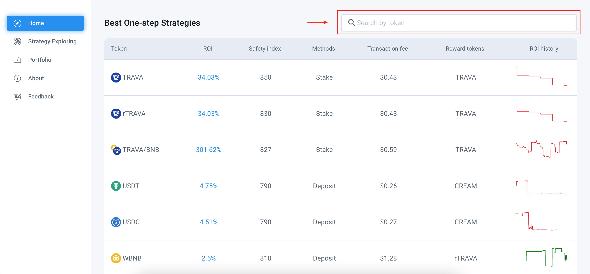
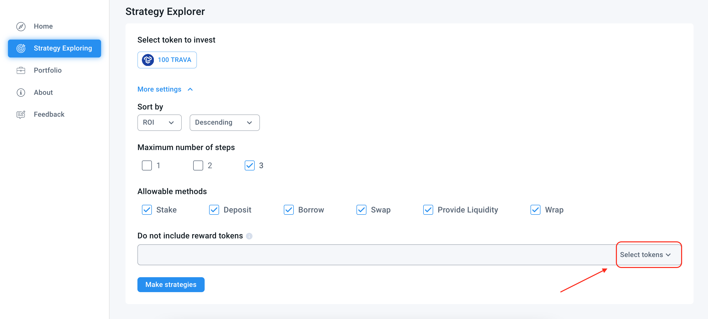
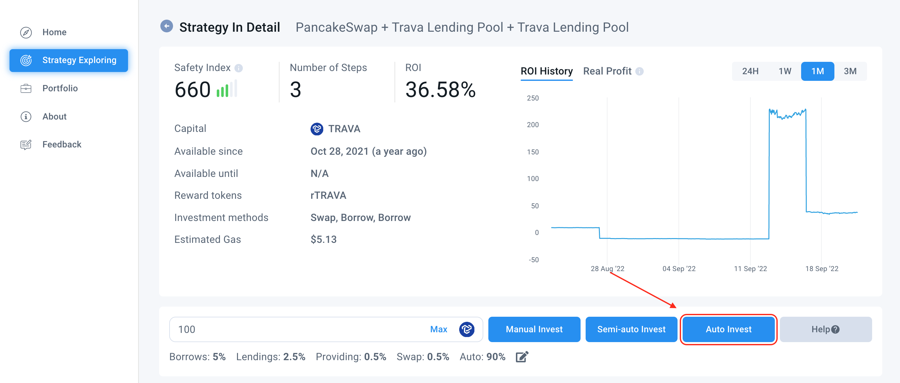
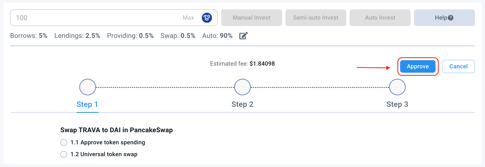

# BRicher User Guide

_BRicher is a unique aggregator that composes multiple investment methods: providing liquidity, swapping, staking, depositing, and borrowing in the lending pools._

_Based on the methods, BRicher automatically builds up **composite strategies** so that you can get the most optimized strategies to maximize your profit. Unlike other aggregators, BRicher lets you own your tokens. Thus you can take full control of your tokens and investment plans._

_BRicher ensures the transparency, clarity, and completeness of the strategy information. We provide all relevant information related to every single step of a **composite strategy**, and you can easily verify it by yourselves._

_This article provides readers with a thorough guideline to use BRicher effectively._

<figure><figcaption></figcaption></figure>

Website: [https://app.trava.finance/bricher/](https://app.trava.finance/bricher/)

BRicher includes three main pages: Home, Strategy Exploring and Portfolio.

## **Home page introduction**

The _Home_ page lists the best one-step investment strategies for all tokens supported by BRicher. Information on each strategy, such as its current ROI, ROI history, transaction fee, and reward tokens, are shown in the table. In addition, you can select a row to get detailed information on the respective strategy.

At the right upper corner of the page, you can enter your favorite token to filter strategies.

<figure><figcaption></figcaption></figure>

To sort the strategies, you can press on the table headers.

## **Strategy Exploring**

In this section, you can search for high-return investment strategies based on your input tokens. Every time you access this page, BRicher automatically calculates and presents the best strategies to you.

**Step 1.** To use the Strategy Exploring page, you must connect and authenticate your wallet first:\
**-** Click the “Connect wallet” button, choose a wallet, enter your password and confirm.\
\- Then click the “Authenticate” button.

**Step 2.** Select the token you prefer to invest in by clicking one option under the line “Select token to invest”.

<figure><figcaption></figcaption></figure>

**Step 3.** Select “More setting” to filter the recommended strategies

<figure><figcaption></figcaption></figure>

* First, you can sort strategies by safety index, ROI, or the number of steps of the strategies.

<figure><figcaption></figcaption></figure>

* You can also set the limit for the number of steps used in your strategies. Strategies with a low number of steps are typically safer, but strategies with a high number of steps are usually more profitable.

<figure><figcaption></figcaption></figure>

* By default, recommended strategies are automatically composed of all yield farming methods. If you do not like a specific method, please deselect it.

<figure><figcaption></figcaption></figure>

* Some vaults/pools offer very high ROI, and they thus dominate the recommended strategies. To explore the other strategies that DO NOT include these vaults/pools, you can add the reward tokens of the vaults/pools to the control.

<figure><figcaption></figcaption></figure>

**Step 4.** Click the “Make strategies” button

<figure><figcaption></figcaption></figure>

* Our algorithm will automatically compute and return appropriate strategies to you. You should pay more attention to the strategy title (which includes names of used DApps), the safety index, the number of steps, and the Return On Investment rate.

<figure><figcaption></figcaption></figure>

## **Make Investment**

After exploring the recommended strategies, if you are interested in a strategy, please click its _“Check detail and Invest”_ button.

<figure><figcaption></figcaption></figure>

BRicher will show general information on the strategy, such as its start and expiration date, reward tokens, estimated gas, ROI history, etc.

<figure><figcaption></figcaption></figure>

BRicher also displays all helpful information on each step. The relevant information is shown depending on the type of method used in the step (staking, depositing, borrowing, providing liquidity pair, swapping). All of them are real-time data collected by BRicher that can save time in making decisions.

There are three methods to make a strategy: manual investing, semi-auto investing, and auto investing. The basic difference between these three is the level that BRicher supports you to make your investment.

* Manual Investing: You need to access each DApps to implement each step by yourself.
* Semi-auto Investing: You only need to stay on the BRicher site, and for each step, you simply click on an “Execute” button. &#x20;
* Auto Investing: All you need to do is click on one button to authorize BRicher to complete the whole process.

### **Manual investing**

**Step 1.** Fill in the amount of capital you want to invest:

<figure><figcaption></figcaption></figure>

**Step 2.** Click the “Manual invest” button

<figure><figcaption></figcaption></figure>

Once you do that, BRicher will save your strategies so that you can monitor the strategy’s effectiveness (the capital, the interest, the reward token, the ROIs, etc.)

You can check the detailed guideline which shows you how to invest step by step as below:

<figure><figcaption></figcaption></figure>

### **Semi-auto Investing**

**Step 1.** Fill in the amount of capital you want to invest

<figure><figcaption></figcaption></figure>

**Step 2.** Click the “Semi-auto Invest” button

<figure><figcaption></figcaption></figure>

**Step 3.** A list of steps will appear.

You can simply finish the progress by clicking each “Execute” button related to each step.

<figure><figcaption></figcaption></figure>

_Notes: If errors occur, there will be pop-up messages and instructions. Users can follow this instruction to continue investing or cancel the investment._

Users can only execute one investment strategy at one time. That means they must finish or cancel the previous investing progress if they want to implement the other plans. Users can implement their strategies and quit the page in the middle. We support them in resuming the implementation process. However, there might be changes in prices and other parameters that affect the strategy.

### **Auto investing**

**Step 1.** Fill in the amount of capital you want to invest

<figure><figcaption></figcaption></figure>

**Step 2.** Click the “Auto Invest” button

<figure><figcaption></figcaption></figure>

After that, a list of steps and gas fee information will appear

Make sure you will check all this information

**Step 3.** To make an investment, click the “Approve” button to delegate BRicher to finish the whole progress for you.

<figure><figcaption></figcaption></figure>

**Step 4.** After approving the progress successfully, click the “Execute” button.

_Notes:_\
&#x20;     _- After all these steps, you still need to keep track of the progress status:_\
&#x20;            \+ _The completed step: Turning Green_\
&#x20;            _+ Unsuccessful step: Turning yellow as a warning notification. Once that happens, there will be an instruction pop-up window. In this case, you can follow this instruction to continue investing or cancel the whole process._\
&#x20;     _- Because of the typical requirements of each DApp, there will be some strategies that can not be invested automatically (Only Manual Investing and Semi-auto Investing are available)_\
&#x20;   _      ****  - Users can only execute one investment strategy at one time. That means they must finish or cancel the previous investing progress if they want to implement the other plans. Users can implement their strategies and quit the page in the middle. We support them in resuming the implementation process. However, there might be changes in prices and other parameters that affect the strategy._

## **Portfolio**  &#x20;

_You first need to connect your wallet to use these functions._

Then, click the “Portfolio” button, and a list of sub-functions will appear, including Asset, BRicher Diaries, Your Investment and Notification.

### Asset Section

<figure><figcaption></figcaption></figure>

In this section, you can check for general information, including total balance, total deposit, total borrow, and total assets.

You can also check the detailed information about your financial status by clicking the three buttons “Your Balance”, “Your Deposit” and “Your Borrow”.

The more detailed information will appear when you click the name of the token

<figure><figcaption></figcaption></figure>

### **“BRicher diaries” section**

BRicher lists all of your investment strategies on this page.

<figure><figcaption></figcaption></figure>

You can change the name of a strategy to recognize it easily by clicking the “Pen” icon and also delete a strategy with the “Trash bin” icon.

<figure><figcaption></figcaption></figure>

To get detailed information on a strategy, please click the “Detail” button.

<figure><figcaption></figcaption></figure>

In addition to the basic information, BRicher helps you to estimate your interest in this strategy based on your original capital and the ROI history.

<figure><figcaption></figcaption></figure>

The ROI History is illustrated in a chart. The starting point of the solid line represents the time you start your strategy.

It also displays other interesting information on your strategy that you can monitor.

### **“Your Investment” section**

This section will display key metrics related to users’ investing plans across different DApps.

As you can see, you can check the total investment and average ROI on the main site.

<figure><figcaption></figcaption></figure>

We categorize your investment into two types, lending, and vault. You can click on the three buttons “All”, “Lending” and “Vault” to check your TVL, ROI, your reward, your deposit, your borrow and ROI history. You can click the protocol name for more detailed information.

<figure><figcaption></figcaption></figure>
