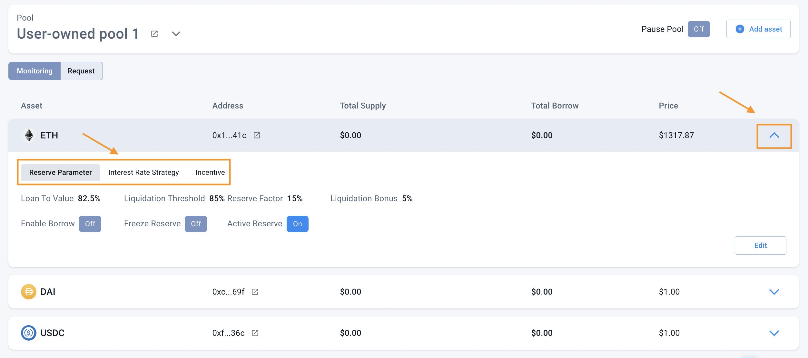

# Governance

Our governance is flexibly adapted to the particular market with several alterable factors such as political, financial and social institutions. They are interactions of users, community, incentives, internal community regulations, and policy management.

## **Rewarding mechanism**

### **Weekly Rewards**

veTRAVA holders will start to earn rewards in TRAVA tokens with a shared APR after they lock their tokens in the Trava Governance vault. Every Tuesday at 3 P.M UTC, users’ claimable rewards will increase based on their voting power proportion in the last week. The bigger amount and the longer time they lock, the more voting power they will possess, and the more attractive their rewards will be. This mechanism aims to encourage users who show significant commitment to the future of the protocol.

### **Warm-up Rewards**

For users who lock their tokens after the Tuesday checkpoint, their weekly rewards will start from next week’s checkpoint, and they will receive other types of rewards from a warm-up vault instead until the next Tuesday. So don’t worry about which day it is. You will receive incentives  right after locking in the Governance vault.

Note that:

The warm-up reward will be applied from 3 P.M UTC 11th May 2022 with the detailed information as below:

.png>)

The APR used for calculating the warm-up rewards is 15%

### **Modified rewarding mechanism**

And to help stabilize the rewards APR as well as bring more benefits to users, the incentive program for each week might have differences, both for the weekly rewards and the warm-up rewards. Therefore, there will be an announcement every Monday. Make sure to follow our channels & feel free to raise your ideas.

With this new incentive mechanism, Trava aims to incentivize our loyal users as well as maintain stability in the downtrend for the long-term development of the protocol.
