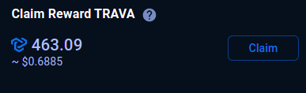
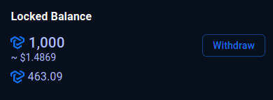
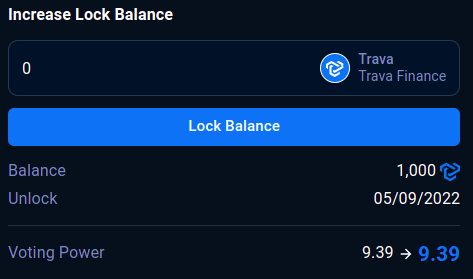
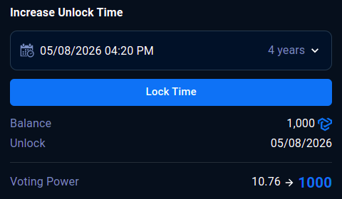

# Trava DAO User Guide

## **Lock your tokens for** veTRAVA

### **Lock Calculator**

Select the token you want to lock, input lock amount, and select unlock time to see how many voting power you will have.

### **Create new** veTRAVA **lock**

1\. Click **Create Lock**, a modal will popup.

**2.** Select the token you want to lock.

**3.** Input lock amount.

**4.** Select unlock time (1 week -> 4 years).

**5.** Click **Create Lock**.

**6.** Your wallet notification will appear, you check again the total amount and gas fee. If they are right, click **Confirm.**

### **Merge** veTRAVA

1\. Select 2 veTRAVA tokens to merge together. veTRAVA with **Released** status can’t be merged.

2\. Claim all claimable rewards of 2 veTRAVA tokens.

3\. Click **Merge.**

4\. Recheck your veTRAVA info and click **Merge** to preview merge result.

5\. Click **Confirm.**

6\. Your wallet notification will appear, you check again the total amount and gas fee. If they are right, click **Confirm.**

### **Claim rewards**

**1.** Click **Claim.**

**2.** Your wallet notification will appear, you check again the total amount and gas fee. If they are right, click **Confirm.**

### **Withdraw veTRAVA**

**1.** Claim all your claimable rewards.

**2.** Your wallet notification will appear, you check again the total amount and gas fee. If they are right, click **Confirm.**

## **Increase your voting power**

### **Increase locked balance**

**1.** Input the increased amount and see how much voting power you will gain.

**2.** Click **Lock Balance.**

**3.** Your wallet notification will appear, you check again the total amount and gas fee. If they are right, click **Confirm.**

### **Increase unlock time**

**1.** Select the unlock time option to increase and see how much voting power you will gain.

**2.** Click **Lock Time.**

**3.** Your wallet notification will appear, you check again the total amount and gas fee. If they are right, click **Confirm.**
